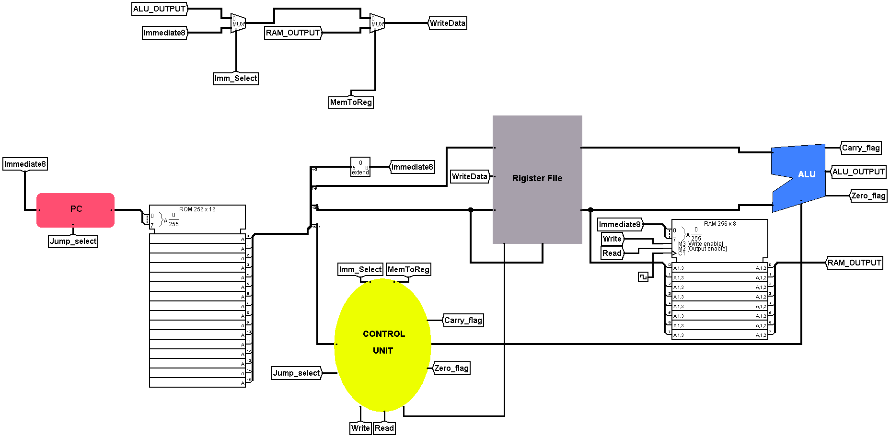
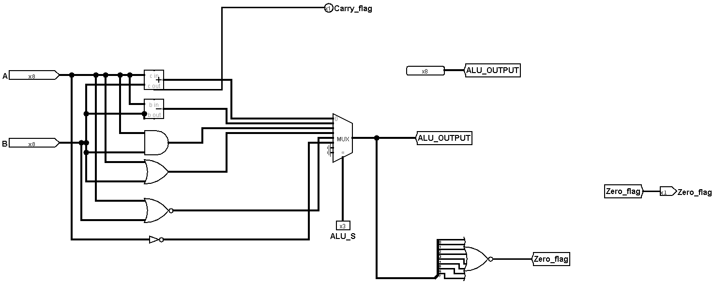
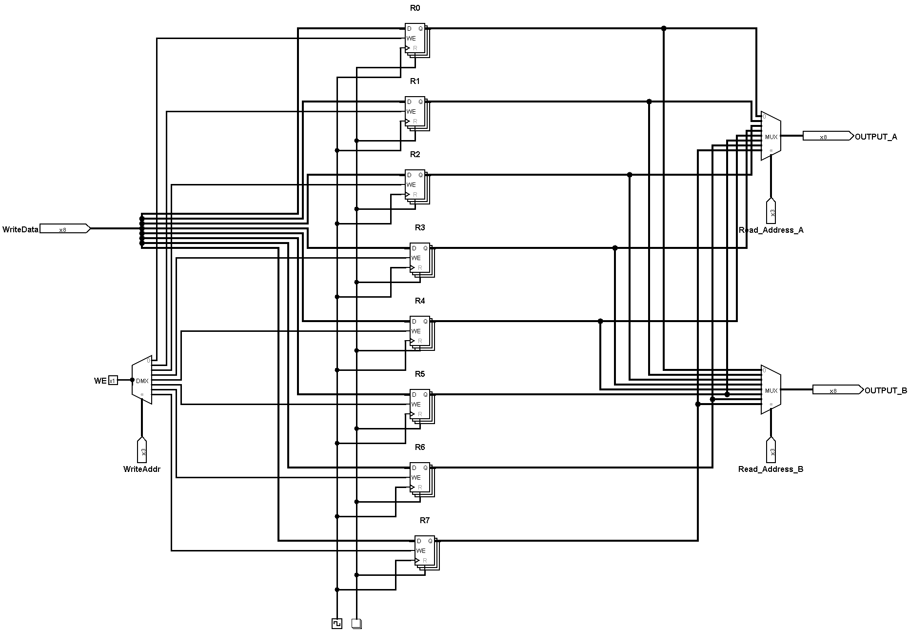
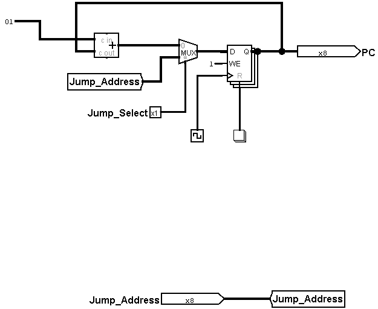

# Falcon-8 CPU

> An educational 8-bit Single-Cycle Processor designed from scratch using Logisim Evolution.

---

## Overview

Falcon-8 is a custom-designed 8-bit educational processor created to understand the fundamentals of CPU architecture.

The processor was implemented entirely in **Logisim Evolution** and includes a complete datapath, control unit, register file, ALU, RAM, ROM, and branching support.

This project was built as part of a Computer Engineering learning journey, focusing on understanding how processors execute instructions at the hardware level.

---

## Features

- 8-bit Single-Cycle CPU
- Custom Instruction Set Architecture (ISA)
- 16-bit Instruction Format
- Register File (8 General Purpose Registers)
- Arithmetic Logic Unit (ALU)
- Instruction ROM
- Data RAM
- Immediate Instructions
- LOAD / STORE Instructions
- Conditional Branching
- Jump Instructions
- Zero Flag
- Carry Flag

---

## CPU Specifications

| Item | Value |
|------|-------|
| Data Width | 8-bit |
| Instruction Width | 16-bit |
| Registers | 8 |
| Architecture | Single-Cycle |
| Instruction Memory | ROM 256×16 |
| Data Memory | RAM 256×8 |

---

## Instruction Format

```
15          11 10      8 7      5 4       0
+-------------+---------+---------+---------+
|  Opcode     |   RD    |   RS    |Immediate|
+-------------+---------+---------+---------+
```

---

## Supported Instructions

### Arithmetic

- ADD
- SUB
- AND
- OR
- XOR
- NOT

### Memory

- LOAD
- STORE

### Data Transfer

- MOV
- LDI

### Branch

- JMP
- JZ
- JNZ
- JC

### Control

- HLT

---

## Architecture

The Falcon-8 processor consists of the following hardware modules:

- Program Counter (PC)
- Instruction ROM
- Control Unit
- Register File
- Arithmetic Logic Unit (ALU)
- Data RAM
- Write-Back Unit

---

## Project Structure

```

Falcon-8-CPU/
│
├── docs/
├── images/
├── logisim/
├── tests/
├── LICENSE
└── README.md

```

---

## Screenshots

### Main CPU



---

### ALU



---

### Register File



---

### Program Counter



---

## Documentation

Detailed documentation is available inside the **Documentation/** folder.

The documentation includes:

- CPU Specifications
- ISA Documentation
- Architecture Overview
- Engineering Log
- Lessons Learned

---

## Future Improvements

This project represents **Version 1.0**.

Future versions may include:

- Pipeline Architecture
- Multi-Core Support
- Stack Pointer
- CALL / RET Instructions
- Interrupt Handling
- Cache Memory
- Performance Optimization

---

## Author

**Abdullah Almutairi**

Electrical & Computer Engineering Student

King Abdulaziz University

---

## License

This project is released under the MIT License.
